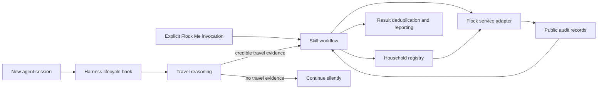

# Architecture

## Objective

Flock Me connects an enrolled household vehicle registry to public Flock Safety audit records. Travel inference determines when an automatic check is timely. Explicit invocation gives the user direct control.

## System boundary

`SKILL.md` defines the reasoning and workflow contract. It does not create the lifecycle hook, state store, normalization code, or service adapter.

## Components

### Skill workflow

The skill accepts only two entry points:

1. a lifecycle instruction requesting the new-session travel review;
2. an explicit Flock Me invocation.

The skill does not activate from ordinary mid-session travel remarks. Each harness package uses the narrowest documented activation control that preserves explicit use. Gemini relies on a narrowly scoped description because it does not document a manual-only skill field.

### Session-start hook

The hook injects a compact instruction into the first ordinary model turn of a new session. The instruction asks the skill to review only the recent history and memory the host makes available since the saved checkpoint.

The hook performs no transcript parsing, travel classification, or network lookup itself. Flock Me uses `SessionStart` with matcher `startup` only. Resume, compact, clear, and fork are ignored. Packages live in `hooks/`.

### Household registry

The registry persists one entry per vehicle:

- an eight-character derived lookup identifier;
- an optional non-sensitive local label.

Raw license plates do not enter persistent state. Portable state is versioned JSON at `~/.flock-me/state.json` or `$FLOCK_ME_STATE`.

### Service adapter

The adapter receives one or more derived identifiers in a single request and returns structured audit records. It owns the external protocol boundary. No supported third-party API contract has been confirmed.

### Checkpoint and result state

Persistent state also contains:

- the last session-review checkpoint;
- the current bounded mobility episode, when one exists;
- identifiers for previously seen audit records.

These values prevent repeated evaluation, repeated requests for one mobility episode, and repeated notification of the same record.

## Automatic flow

1. Start a new agent session.
2. Load the registry and last checkpoint.
3. If no vehicles are enrolled, follow the one-time setup-offer policy.
4. Review the available recent context since the checkpoint.
5. Infer whether the user or another household member traveled outside the home.
6. If travel is credible, select the contextual vehicle or all vehicles when ambiguous.
7. Submit one batched lookup.
8. Persist the checkpoint and any newly seen record identifiers.
9. Surface previously unseen matching records. Otherwise continue silently.

## Explicit flow

1. Receive the explicit Flock Me invocation.
2. Run `runtime/src/cli.ts` for setup, registry management, or `check`.
3. For a check with no additional instruction, select all enrolled vehicles.
4. Submit one batched lookup without requiring travel evidence.
5. Report matching records or state that the available public dataset contains no match.

## Failure contract

Missing state, normalization, or service components fail explicitly. The skill does not fabricate results, switch to an unrelated lookup method, retain raw plates, or claim access to context the host did not supply.
